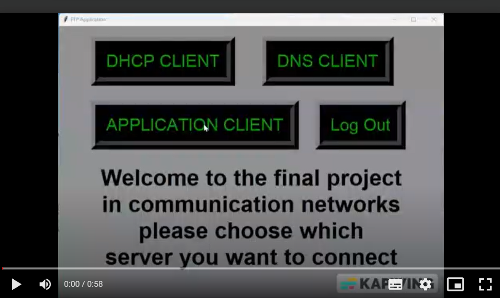

# Reliable File Transfer System over RUDP

## Overview

This project introduces a robust file transfer system built on Reliable UDP (RUDP), enhanced with custom implementations of DHCP (Dynamic Host Configuration Protocol) and DNS (Domain Name System) functionalities. Designed to combine UDP's efficiency with TCP-like reliability, our system ensures fast and reliable file transfers, dynamic IP address allocation, and effective domain name resolution.

## Reliable UDP (RUDP) Protocol

RUDP adds reliability features to UDP transmissions, including sequence numbering for packet order and integrity, acknowledgments (ACKs) for received packets, retransmission of lost packets, and control mechanisms for flow and congestion. This protocol serves as the foundation of our file transfer system, ensuring data integrity and delivery without the overhead of TCP.

### Features

- **Sequence Numbers & ACKs**: Guarantees data order and confirms packet delivery.
- **Retransmission**: Lost packets are automatically resent based on missing ACKs.
- **Flow & Congestion Control**: Dynamically adjusts transmission rate to network conditions.

## DHCP Implementation

Our system includes a DHCP server for dynamic IP address allocation. This feature automatically assigns IP addresses to client devices, managing network configurations without manual setup.

### DHCP Workflow

1. **Discovery**: Clients broadcast a discovery message to identify available DHCP servers.
2. **Offer**: The DHCP server offers an IP address to the client.
3. **Request**: The client requests the offered IP address.
4. **Acknowledgment**: The server assigns the IP address to the client and sends an acknowledgment.

## DNS Functionality

The DNS component allows clients to resolve domain names into IP addresses, facilitating connections to the server using human-readable names rather than numeric IP addresses.

### DNS Process

1. **Query**: A client sends a query to the DNS server with the domain name.
2. **Lookup**: The DNS server looks up the domain name in its records.
3. **Response**: The server responds with the corresponding IP address.

To incorporate the instructions for running your application into the `README.md`, you can add a specific section dedicated to guiding users through the setup and execution process. Here’s how you can structure this section to ensure clarity and ease of use:

---

## Getting Started

To use the application, follow the steps below to launch the various components in the correct order. Each component is a critical part of the infrastructure, enabling dynamic IP configuration, domain name resolution, and the core file transfer functionality.

### Prerequisites

Ensure Python is installed on your system and that you have administrative or sufficient privileges to bind applications to network ports.

### Step 1: Start the DNS Server

Run the DNS server to enable domain name resolution:

```bash
python server_dns.py
```

This server will handle queries for translating domain names into IP addresses.

### Step 2: Launch the DHCP Server

Start the DHCP server for dynamic IP address allocation:

```bash
python server_dhcp.py
```

This component assigns IP addresses to clients dynamically, facilitating network configuration.

### Step 3: Activate the File Transfer Server

Initialize the main file transfer server application:

```bash
python server_app.py
```

This server manages file upload, download, and other related operations.

### Step 4: Run the Client Application

Finally, start the client GUI to interact with the file transfer system:

```bash
python client_gui.py
```

Through the GUI, users can connect to the server, upload, download files, and perform other actions as supported by the application.

## Demonstrations

### Video Demonstration

[](https://drive.google.com/drive/my-drive)


## Usage

With all components running, you can use the client GUI to perform file transfers. Ensure the DHCP and DNS services are operational before attempting to connect through the client to ensure smooth functionality.

This section provides clear, step-by-step instructions for setting up and running your application, from starting the necessary servers to launching the client interface. Adjust the filenames and paths as necessary to match your project's structure and ensure all prerequisites are met before proceeding with these steps.

## Conclusion

Our file transfer system showcases the potential of combining traditional protocols with modern enhancements to achieve high efficiency and reliability in data transmission. By integrating RUDP, DHCP, and DNS into a cohesive system, we address the complexities of network communications, offering a streamlined solution for file transfers.
